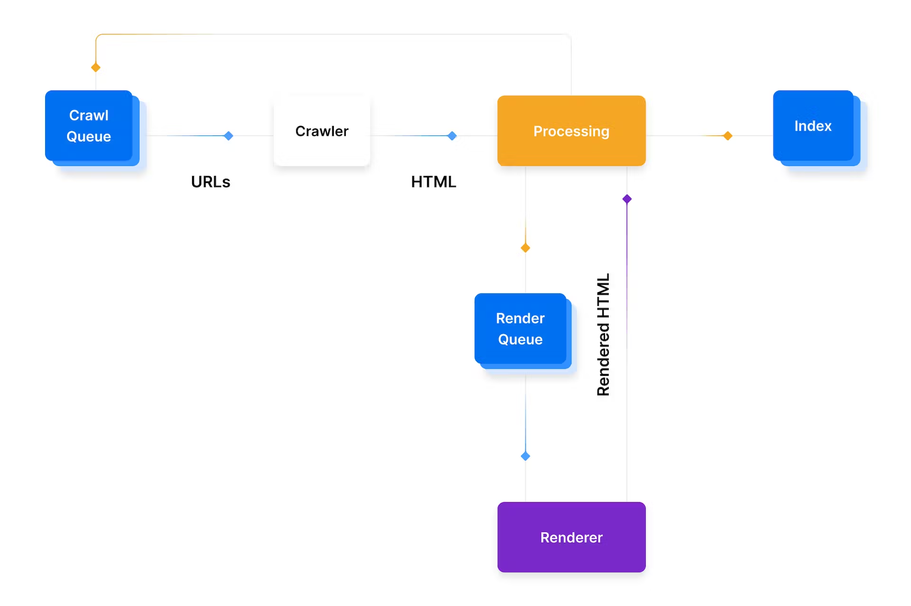

## Introduction to SEO

#### Three Pillars of Optimization

1. Technical – Optimize your website for **crawling** and web performance.

2. Creation – Create a content strategy to target specific **keywords**.

3. Popularity – Boost your site's presence online so search engines know you are a trusted source. This is done through the use of **backlinks** – third-party sites that link back to your site.

#### The Journey of Googlebot



**Further Reading**

- [SEO Starter Guide](https://developers.google.com/search/docs/fundamentals/seo-starter-guide)

- [MDN: User-Agents](https://developer.mozilla.org/en-US/docs/Web/HTTP/Headers/User-Agent)

# Crawling and Indexing

#### 301/308

```
export async function getStaticProps(context) {
  return {
    redirect: {
      destination: '/',
      permanent: true, // triggers 308
    },
  };
}
```

```
//next.config.js

module.exports = {
  async redirects() {
    return [
      {
        source: '/about',
        destination: '/',
        permanent: true, // triggers 308
      },
    ];
  },
};
```

#### [404](https://nextjs.org/docs/advanced-features/custom-error-page#404-page)

```
export async function getStaticProps(context) {
  return {
    notFound: true, // triggers 404
  };
}
```

```
// pages/404.js

export default function Custom404() {
  return <h1>404 - Page Not Found</h1>;
}
```

#### [500](https://nextjs.org/docs/advanced-features/custom-error-page#500-page)

```
// pages/500.js

export default function Custom500() {
  return <h1>500 - Server-side error occurred</h1>;
}
```

## robots.txt

```
//public/robots.txt

# Block all crawlers for /accounts
User-agent: *
Disallow: /accounts

# Allow all crawlers
User-agent: *
Allow: /
```

Further Reading

- [Create and Submit a robots.txt File](https://developers.google.com/search/docs/advanced/robots/create-robots-txt)

## XML Sitemaps

#### Manual

```
<!-- public/sitemap.xml -->

<xml version="1.0" encoding="UTF-8">
  <urlset xmlns="http://www.sitemaps.org/schemas/sitemap/0.9">
    <url>
      <loc>http://www.example.com/foo</loc>
      <lastmod>2021-06-01</lastmod>
    </url>
  </urlset>
</xml>
```

#### getServerSideProps

```
//pages/sitemap.xml.js

const EXTERNAL_DATA_URL = 'https://jsonplaceholder.typicode.com/posts';

function generateSiteMap(posts) {
  return `<?xml version="1.0" encoding="UTF-8"?>
   <urlset xmlns="http://www.sitemaps.org/schemas/sitemap/0.9">
     <!--We manually set the two URLs we know already-->
     <url>
       <loc>https://jsonplaceholder.typicode.com</loc>
     </url>
     <url>
       <loc>https://jsonplaceholder.typicode.com/guide</loc>
     </url>
     ${posts
       .map(({ id }) => {
         return `
       <url>
           <loc>${`${EXTERNAL_DATA_URL}/${id}`}</loc>
       </url>
     `;
       })
       .join('')}
   </urlset>
 `;
}

function SiteMap() {
  // getServerSideProps will do the heavy lifting
}

export async function getServerSideProps({ res }) {
  // We make an API call to gather the URLs for our site
  const request = await fetch(EXTERNAL_DATA_URL);
  const posts = await request.json();

  // We generate the XML sitemap with the posts data
  const sitemap = generateSiteMap(posts);

  res.setHeader('Content-Type', 'text/xml');
  // we send the XML to the browser
  res.write(sitemap);
  res.end();

  return {
    props: {},
  };
}

export default SiteMap;
```

**Further Reading**

- [Learn about Sitemaps](https://developers.google.com/search/docs/advanced/sitemaps/overview)
- [Overview of crawling and indexing topics](https://developers.google.com/search/docs/crawling-indexing)

## Meta Tags

#### Meta robots tags || robots.txt || Directives tags

```
<meta name="robots" content="all" />
```

Documentation: [Valid indexing and serving rules](https://developers.google.com/search/docs/advanced/robots/robots_meta_tag#directives)

#### Canonical tags

```
<link rel="canonical" href="https://example.com/products/phone" />
```

**Further Reading**

- [Consolidate Duplicate URLs](https://developers.google.com/search/docs/advanced/crawling/consolidate-duplicate-urls)

## Rendering and Ranking

1. Static Site Generation (SSG)
  - pre-rendered
  - HTML is generated at build time

2. Server-Side Rendering (SSR)
  - pre-rendered
  - HTML is generated at request time

3. Client Side Rendering (CSR)
  - On initial page load a single HTML file is generally served with little to no content until you fetch the JavaScript and the browser compiles everything.
  - **Not** recommended for optimal SEO

#### URL Structure

- Semantic
- Patterns that are logical and consistent
- Keyword focused
- Not parameter-based

## Metadata

#### Search Engine Results Page (SERP)


```
<title>iPhone 12 XS Max For Sale in Colorado - Big Discounts | Apple</title>
<meta
  name="description"
  content="Check out iPhone 12 XR Pro and iPhone 12 Pro Max. Visit your local store and for expert advice."
/>
```

#### [Open Graph Protocol](https://ogp.me/) for Social Media

```
<meta property="og:title" content="Social Title for Cool Page" />
<meta
  property="og:description"
  content="And a social description for our cool page"
/>
<meta
  property="og:image"
  content="https://example.com/images/cool-page.jpg"
/>
```

#### [Stuctured Data with JSON-LD Encoding](https://schema.org/)

```
import Head from 'next/head';

function ProductPage() {
  function addProductJsonLd() {
    return {
      __html: `{
      "@context": "https://schema.org/",
      "@type": "Product",
      "name": "Executive Anvil",
      "image": [
        "https://example.com/photos/1x1/photo.jpg",
        "https://example.com/photos/4x3/photo.jpg",
        "https://example.com/photos/16x9/photo.jpg"
       ],
      "description": "Sleeker than ACME's Classic Anvil, the Executive Anvil is perfect for the business traveler looking for something to drop from a height.",
      "sku": "0446310786",
      "mpn": "925872",
      "brand": {
        "@type": "Brand",
        "name": "ACME"
      },
      "review": {
        "@type": "Review",
        "reviewRating": {
          "@type": "Rating",
          "ratingValue": "4",
          "bestRating": "5"
        },
        "author": {
          "@type": "Person",
          "name": "Fred Benson"
        }
      },
      "aggregateRating": {
        "@type": "AggregateRating",
        "ratingValue": "4.4",
        "reviewCount": "89"
      },
      "offers": {
        "@type": "Offer",
        "url": "https://example.com/anvil",
        "priceCurrency": "USD",
        "price": "119.99",
        "priceValidUntil": "2020-11-20",
        "itemCondition": "https://schema.org/UsedCondition",
        "availability": "https://schema.org/InStock"
      }
    }
  `,
    };
  }
  return (
    <div>
      <Head>
        <title>My Product</title>
        <meta
          name="description"
          content="Super product with free shipping."
          key="desc"
        />
        <script
          type="application/ld+json"
          dangerouslySetInnerHTML={addProductJsonLd()}
          key="product-jsonld"
        />
      </Head>
      <h1>My Product</h1>
      <p>Super product for sale.</p>
    </div>
  );
}

export default ProductPage;
```

**Further Reading**

- [Intro to Structured Data](https://developers.google.com/search/docs/guides/intro-structured-data)
- [Product Structured Data](https://developers.google.com/search/docs/data-types/product)
- [Rich Results Tester](https://search.google.com/test/rich-results)

## On Page SEO

#### next/link

If the child of Link is a custom component that wraps an a tag, you must add **`passHref`** to Link. This is necessary if you’re using libraries like styled-components. Without this, the a tag will not have the href attribute, which affects your site’s SEO.

```
import Link from 'next/link';
import styled from 'styled-components';

// This creates a custom component that wraps an <a> tag
const RedLink = styled.a`
  color: red;
`;

function NavLink({ href, name }) {
  // Must add passHref to Link
  return (
    <Link href={href} passHref>
      <RedLink>{name}</RedLink>
    </Link>
  );
}

export default NavLink;
```

## Web Performance & Core Web Vitals